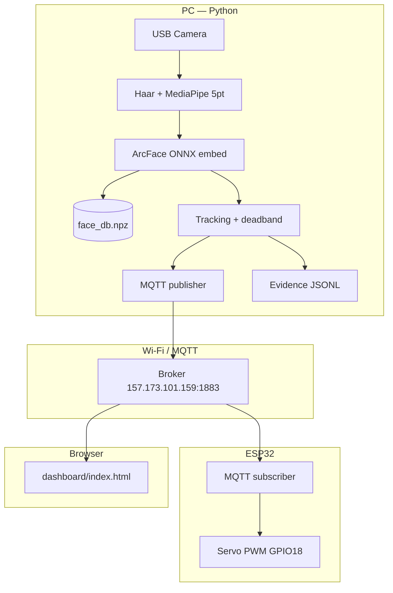
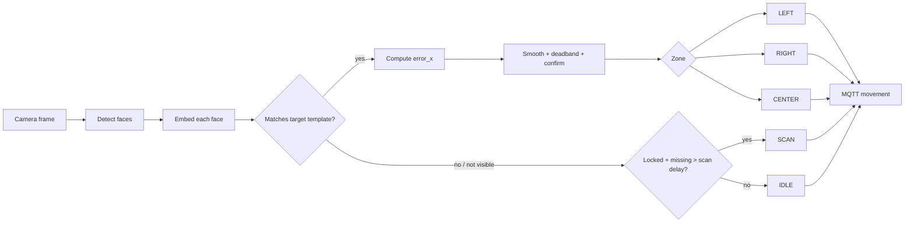

# BENAX — AI-Powered Single-Speaker Face Recognition & Camera Tracking

**Face Locking** is an integrated assessment project: enroll one authorized speaker, recognize only that identity in a live camera feed, track horizontal position, publish MQTT motor commands to an ESP32/ESP8266 servo mount, log verifiable evidence, and re-acquire the same speaker after occlusion or leaving the frame.

This README is the **master test guide** — follow every stage in order from hardware setup through final demonstration.

---

## Table of Contents

1. [What the system does](#1-what-the-system-does)
2. [Architecture](#2-architecture)
3. [Prerequisites](#3-prerequisites)
4. [Stage 0 — Install software](#stage-0--install-software)
5. [Stage 1 — Verify camera](#stage-1--verify-camera)
6. [Stage 2 — Verify MQTT & servo (no AI)](#stage-2--verify-mqtt--servo-no-ai)
7. [Stage 3 — Speaker enrollment](#stage-3--speaker-enrollment)
8. [Stage 4 — Local recognition (no MQTT)](#stage-4--local-recognition-no-mqtt)
9. [Stage 5 — Speaker lock](#stage-5--speaker-lock)
10. [Stage 6 — Full tracking + MQTT](#stage-6--full-tracking--mqtt)
11. [Stage 7 — Multi-face robustness](#stage-7--multi-face-robustness)
12. [Stage 8 — Out of frame & SEARCH](#stage-8--out-of-frame--search)
13. [Stage 9 — Dashboard monitoring](#stage-9--dashboard-monitoring)
14. [Stage 10 — Evidence & logging](#stage-10--evidence--logging)
15. [Final validation checklist](#final-validation-checklist)
16. [Reference — all commands](#reference--all-commands)
17. [MQTT topics & payloads](#mqtt-topics--payloads)
18. [ESP32 firmware & wiring](#esp32-firmware--wiring)
19. [Troubleshooting](#troubleshooting)

---

## 1. What the system does

| Activity | What you demonstrate |
|----------|----------------------|
| **Enrollment** | Capture 10–30 face samples → one L2-normalized embedding template per speaker |
| **Single-identity recognition** | Only the enrolled `--target-name` is accepted; other faces are ignored for lock/tracking |
| **Tracking** | Horizontal error (face center vs frame center) → `LEFT` / `RIGHT` / `CENTER` |
| **MQTT motor control** | PC publishes commands; ESP32 subscribes and drives the servo |
| **Re-acquisition** | Speaker lost → after delay → `SCAN` (servo sweep) → same identity re-locked when visible again |
| **Evidence** | JSONL + text logs with identity, confidence, timestamps, motor commands |

---

## 2. Architecture



**Recognize → Track → Command pipeline:**



---

## 3. Prerequisites

### Hardware

| Item | Role |
|------|------|
| USB camera | Capture, detection, recognition, tracking |
| Laptop/PC | Run Python AI pipeline |
| ESP32 (or ESP8266) | MQTT subscriber, servo PWM |
| Servo motor | Horizontal pan |
| 2-DOF mount | Camera + tilt adjustment |
| Jumper wires | Signal, 5V, GND |
| Stable 5V (if needed) | Servo supply — do not stall on weak USB |

### Software

- **Python 3.10+** (3.10–3.13 tested; avoid 3.14 for now)
- **Arduino IDE** or **arduino-cli** (ESP32 core + PubSubClient + ESP32Servo)
- **MQTT broker** — default: `157.173.101.159:1883`

### Model files (required)

Place in `models/`:

- `embedder_arcface.onnx`
- `face_landmarker.task`

---

## Stage 0 — Install software

From the **repo root**:

```powershell
cd C:\Users\RCA_USER_66\Desktop\FaceLocking-main\FaceLocking-main
pip install -r requirements.txt
```

CPU-only machines use `onnxruntime` from requirements — no GPU required.

**Flash ESP32** (after Wi-Fi credentials are set in `addons/mqtt_servo_tracking/esp32/face_tracker.ino`):

```powershell
powershell -ExecutionPolicy Bypass -File addons/mqtt_servo_tracking/esp32/upload.ps1 -Port COM6
```

Replace `COM6` with your serial port (`arduino-cli board list`).

**Expected:** On boot, servo sweeps 45°→135°→90°; Serial Monitor (115200) shows WiFi + MQTT subscribed to `vision/elvin/movement`.

---

## Stage 1 — Verify camera

Enrollment and recognition auto-try camera indexes **0, 1, 2** (index **0** works on most Windows setups).

Quick probe:

```powershell
python -c "from src.enroll import open_camera; c,i=open_camera((0,1,2)); print('OK index',i); c.release()"
```

**Pass criteria:** Prints `Camera ready on index 0` (or 1/2) and no error.

Optional OpenCV smoke test:

```powershell
python -m src.camera
```

Press **q** to quit.

---

## Stage 2 — Verify MQTT & servo (no AI)

Confirms broker + ESP32 wiring **before** running face recognition.

```powershell
python addons/mqtt_servo_tracking/scripts/mqtt_servo_test.py
```

**Pass criteria:**

| Check | Expected |
|-------|----------|
| Script output | `Publishing CENTER/RIGHT/LEFT/... -> vision/elvin/movement` |
| Servo motion | Visible pan during RIGHT/LEFT/SCAN |
| Serial Monitor | `[MQTT] Received: RIGHT` etc. |

**Topics (default — change all together if you rename):**

| Topic | Purpose |
|-------|---------|
| `vision/elvin/movement` | Motor commands (ESP32 subscribes) |
| `vision/elvin/status` | Dashboard JSON (Python publishes) |

---

## Stage 3 — Speaker enrollment

Creates the facial profile used for all later recognition.

```powershell
python -m src.enroll
```

1. Enter speaker name: **`Elvin`** (or your assessor-assigned name)
2. Face the camera with stable lighting
3. Capture **15+ samples** (angles, slight expressions)

| Key | Action |
|-----|--------|
| **SPACE** | Capture one sample (face must be detected) |
| **a** | Toggle auto-capture |
| **s** | Save to database |
| **r** | Reset *new* samples (keeps existing crops on disk) |
| **q** | Quit |

**Outputs:**

- `data/db/face_db.npz` — embedding vectors
- `data/db/face_db.json` — metadata
- `data/enroll/Elvin/*.jpg` — aligned 112×112 crops (optional)

**Pass criteria:**

```powershell
python -c "import numpy as np; print(np.load('data/db/face_db.npz').files)"
```

Shows `['Elvin']` (or your name).

**Re-enroll / rebuild from crops:**

```powershell
python -m src.rebuild_db
```

---

## Stage 4 — Local recognition (no MQTT)

Verifies recognition **without** servo or network.

```powershell
python -m src.recognize --target-name Elvin
```

| Key | Action |
|-----|--------|
| **+** / **=** | Increase distance threshold (stricter match) |
| **-** | Decrease threshold (more lenient) |
| **←** / **→** | Select face when multiple detected |
| **r** | Reload `face_db.npz` from disk |
| **d** | Debug overlay |
| **q** | Quit |

**Pass criteria:** Your face shows as **Elvin** with confidence/distance on screen. Other people should **not** match unless threshold is too low.

---

## Stage 5 — Speaker lock

Still in `src.recognize`:

1. Wait until **Elvin** is recognized (green box / label)
2. Press **l** to **lock** onto the selected recognized face
3. Press **l** again to unlock

**Pass criteria:** UI shows locked state; only the locked identity is tracked for head-movement logging.

Action history (when locking):

```text
logs/Elvin_history_[timestamp].txt
```

Example line:

```text
2026-06-12 15:20:20 - HEAD_RIGHT: Moved right by 31.9px
```

---

## Stage 6 — Full tracking + MQTT

Runs recognition + lock + tracking + MQTT in one process.

```powershell
python addons/mqtt_servo_tracking/recognize_mqtt.py --target-name Elvin
```

**Recommended flags** (copy-paste):

```powershell
python addons/mqtt_servo_tracking/recognize_mqtt.py --target-name Elvin --mqtt-broker 157.173.101.159 --mqtt-port 1883 --mqtt-topic vision/elvin/movement --mqtt-status-topic vision/elvin/status --camera-width 960 --camera-height 540 --max-faces 5 --locked-max-faces 5 --detect-every 2 --recognize-every 3 --landmark-roi-width 224 --deadzone-px 70 --center-zone-ratio 0.36 --center-exit-hysteresis-px 45 --error-smooth-alpha 0.35 --command-hold-sec 0.25 --scan-delay-sec 0.8 --reacquire-hold-sec 0.30 --command-confirm-frames 2 --mqtt-min-interval 0.15 --mqtt-status-min-interval 0.25
```

| Key | Action |
|-----|--------|
| **l** | Lock / unlock target speaker |
| **+** / **-** | Adjust recognition threshold |
| **d** | Debug overlay (MQTT, evidence path, timing) |
| **r** | Reload database |
| **q** | Quit |

**Test procedure:**

1. Start `recognize_mqtt.py`
2. Press **l** when Elvin is recognized → **LOCKED**
3. Move **left** → dashboard/servo: **LEFT** (MOVED LEFT)
4. Move **right** → **RIGHT**
5. Center face in middle band → **CENTER** (CENTERED)

**Pass criteria:** Servo follows speaker; MQTT test script is **not** needed during this stage.

**MQTT-only dry run** (no camera):

```powershell
python addons/mqtt_servo_tracking/recognize_mqtt.py --disable-mqtt
```

---

## Stage 7 — Multi-face robustness

**Goal:** Other faces in frame must **not** drive the servo.

1. Lock onto **Elvin** (`l`)
2. Have a second person enter the frame
3. Move the non-target person — servo should **not** track them
4. Move **Elvin** — servo **should** track Elvin only

**Pass criteria:** Only the enrolled target controls `LEFT`/`RIGHT`/`CENTER`. Evidence log shows multiple `face_boxes` but `target` remains Elvin.

---

## Stage 8 — Out of frame & SEARCH

**Goal:** Demonstrate controlled search and re-acquisition of the **same** speaker.

1. Lock onto Elvin
2. Leave the camera view or cover your face for **> `--scan-delay-sec`** (default 0.8s)
3. Observe command change to **SCAN** (dashboard: **SEARCHING**)
4. Servo sweeps to search
5. Return to frame — system re-acquires **Elvin** (not a random face)
6. Tracking resumes: **LEFT** / **RIGHT** / **CENTER**

| State | MQTT command | Meaning |
|-------|--------------|---------|
| Locked, face visible, off-center | LEFT / RIGHT | Track speaker |
| Locked, face in center band | CENTER | Hold servo |
| Locked, face missing briefly | IDLE | Wait before search |
| Locked, face missing > scan delay | SCAN | Out of frame — sweep |
| Not locked | IDLE | No tracking |

**Pass criteria:** SCAN only after delay; same identity re-locked after return; assessor can read this in dashboard stage **5 Search** and evidence JSONL.

---

## Stage 9 — Dashboard monitoring

Open in a browser (double-click or drag into Chrome/Edge):

```text
dashboard/index.html
```

**Connection defaults:**

| Field | Value |
|-------|-------|
| WebSocket | `ws://157.173.101.159:8083/mqtt` |
| Movement topic | `vision/elvin/movement` |
| Status topic | `vision/elvin/status` |

Click **Reconnect** after changing URLs.

**Dashboard shows:**

- Pipeline stages: Enroll → Recognize → Lock → Track → Search
- Motor command with plain labels (MOVED LEFT, CENTERED, SEARCHING, …)
- Speaker lock state + in-frame / out-of-frame badges
- Confidence, distance, error pixels, FPS
- Live event log

**Pass criteria:** Dashboard updates in real time while `recognize_mqtt.py` runs; status topic is authoritative (movement topic is fallback only).

> Browsers cannot use plain MQTT port `1883` — WebSocket is required.

---

## Stage 10 — Evidence & logging

### Structured JSONL (assessment evidence)

**Path:**

```text
logs/evidence/face_tracking_evidence_[timestamp].jsonl
```

Each line is one JSON record with:

- `target`, `timestamp`, `seq`
- `faces`, `face_boxes`, recognition per face
- `confidence`, `target_distance`, `threshold`
- `locked`, `locked_face_found`
- `error_x`, `movement` (motor command)
- `mqtt_published`, `mqtt_connected`

**Disable only for informal tests:**

```powershell
python addons/mqtt_servo_tracking/recognize_mqtt.py --disable-evidence-log ...
```

### Action history (face lock events)

```text
logs/Elvin_history_[timestamp].txt
```

Head movement, smile/blink events, lock/unlock, face lost/found.

**Pass criteria:** Submit JSONL + history files with your demonstration.

---

## Final validation checklist

Use this table when presenting to assessors:

| # | Test | Command / action | Expected result | Evidence |
|---|------|------------------|-----------------|----------|
| 1 | Install | `pip install -r requirements.txt` | No errors | — |
| 2 | Camera | `open_camera` / enroll window opens | Live video index 0 | Screenshot |
| 3 | Servo MQTT | `mqtt_servo_test.py` | Servo moves, serial logs Received | Video |
| 4 | Enroll | `python -m src.enroll` → **s** | `face_db.npz` contains Elvin | DB + crops |
| 5 | Recognize | `python -m src.recognize --target-name Elvin` | Name + confidence on screen | Screenshot |
| 6 | Lock | Press **l** | Locked state | history txt |
| 7 | Track L/R | Move in frame while locked | LEFT/RIGHT/CENTER | Dashboard + JSONL |
| 8 | Multi-face | Second person in frame | Servo ignores non-target | Video + JSONL |
| 9 | Out of frame | Walk away while locked | SCAN after delay | Dashboard SEARCHING |
| 10 | Re-acquire | Return to frame | Same Elvin locked again | JSONL `locked_face_found` |
| 11 | Dashboard | Open `dashboard/index.html` | Live telemetry | Screenshot |
| 12 | Logs | After full run | JSONL + history exist | Files |

---

## Reference — all commands

### Enrollment (`python -m src.enroll`)

| Key | Function |
|-----|----------|
| SPACE | Capture sample |
| a | Auto-capture on/off |
| s | Save to DB |
| r | Reset new samples |
| q | Quit |

### Local recognition (`python -m src.recognize --target-name Elvin`)

| Key | Function |
|-----|----------|
| l | Lock / unlock speaker |
| ← → | Select face index |
| + / - | Threshold |
| r | Reload DB |
| d | Debug |
| q | Quit |

### MQTT tracking (`recognize_mqtt.py`)

Same keys as local recognition, plus MQTT publish and evidence logging.

### Servo test (`mqtt_servo_test.py`)

No keys — runs CENTER → RIGHT → LEFT → RIGHT → CENTER → SCAN → IDLE automatically.

### Useful CLI flags

| Flag | Purpose |
|------|---------|
| `--target-name Elvin` | Authorized speaker only |
| `--camera-index 0` | Force camera (default: auto 0,1,2 in enroll) |
| `--scan-delay-sec 0.8` | Delay before SCAN when face lost |
| `--deadzone-px 70` | Ignore small horizontal error |
| `--center-zone-ratio 0.36` | Center band width |
| `--disable-mqtt` | Recognition without servo |
| `--disable-evidence-log` | Skip JSONL (not for assessment) |
| `--profile` | Show CPU timing overlay |

---

## MQTT topics & payloads

**Broker:** `157.173.101.159:1883`

| Topic | Direction | Content |
|-------|-----------|---------|
| `vision/elvin/movement` | PC → ESP32 | `LEFT`, `RIGHT`, `CENTER`, `SCAN`, `IDLE` |
| `vision/elvin/status` | PC → Dashboard | JSON telemetry |

**Movement meanings:**

| Payload | Assessment label | Behavior |
|---------|------------------|----------|
| `LEFT` | MOVED LEFT | Face left of center — pan servo |
| `RIGHT` | MOVED RIGHT | Face right of center |
| `CENTER` | CENTERED | Face in accept band — hold |
| `SCAN` | OUT OF FRAME / SEARCH | Sweep to re-acquire speaker |
| `IDLE` | STOPPED | No active track command |

---

## ESP32 firmware & wiring

**Sketch:** `addons/mqtt_servo_tracking/esp32/face_tracker.ino`

| Setting | Default |
|---------|---------|
| `MQTT_SERVER` | `157.173.101.159` |
| `MQTT_TOPIC` | `vision/elvin/movement` |
| `SERVO_PIN` | GPIO **18** (D18) |

| Wire | Connect |
|------|---------|
| Servo signal | ESP32 **D18** |
| Servo V+ | 5V (external supply recommended) |
| Servo GND | GND (common with ESP32) |

**Legacy ESP8266:** `addons/mqtt_servo_tracking/esp8266/face_tracker_servo/` (D5 / GPIO14).

**Safety:** Set angle limits; secure mount before SCAN; flip `REVERSE_SERVO` if pan direction is inverted.

---

## Troubleshooting

| Problem | Fix |
|---------|-----|
| Camera won't open | Auto-probe uses index 0 first; try `--camera-index 0` |
| `argparse` / import errors | `pip install -r requirements.txt`; use latest repo |
| ONNX dimension error on capture | Fixed in `embed.py` (NCHW layout) — pull latest |
| Empty database | Run enrollment or `python -m src.rebuild_db` |
| Servo doesn't move | Run `mqtt_servo_test.py`; check WiFi, topic, GPIO18, power |
| ESP32 no `[MQTT] Received` | Reflash firmware; confirm topic `vision/elvin/movement` |
| Dashboard offline | Use WebSocket URL, not port 1883; click Reconnect |
| SCAN too soon / too late | Tune `--scan-delay-sec` |
| Jittery servo | Increase `--deadzone-px`, `--command-confirm-frames`, `--command-hold-sec` |
| Wrong person accepted | Press **-** to lower threshold sensitivity or re-enroll with more samples |

---

## Project layout

| Path | Purpose |
|------|---------|
| `src/enroll.py` | Speaker enrollment |
| `src/recognize.py` | Local recognition + lock |
| `src/rebuild_db.py` | Rebuild DB from crops |
| `addons/mqtt_servo_tracking/recognize_mqtt.py` | Full pipeline + MQTT + evidence |
| `addons/mqtt_servo_tracking/scripts/mqtt_servo_test.py` | Servo/MQTT verification |
| `addons/mqtt_servo_tracking/esp32/face_tracker.ino` | ESP32 firmware |
| `dashboard/index.html` | Live assessment dashboard |
| `data/db/face_db.npz` | Enrolled embeddings |
| `logs/evidence/*.jsonl` | Structured operational evidence |
| `logs/*_history_*.txt` | Face-lock action history |

---

**Assessment time budget:** ~6 hours — follow stages 0–10 in order, collect checklist evidence, demonstrate multi-face ignore + out-of-frame SEARCH + re-acquisition on the live dashboard.
